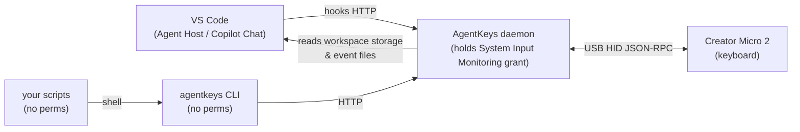

# micro2-agent-keys

Turn a [Work Louder Creator Micro 2](https://worklouder.cc/creator-micro-2) or a
[Codex Micro](https://worklouder.cc/codex-micro) into an at-a-glance
control surface for up to 20 coding-agent sessions. AgentKeys connects VS Code, the command line,
and a local HTTP API to physical keys, so each concurrent session has a dedicated, color-coded
status indicator you can act on without hunting through editor tabs.

No custom firmware. It coexists with Input.app at runtime and talks to the device over
its existing USB HID interface, using the JSON-RPC messages the stock firmware already
accepts. Keep Input.app running so its key macros continue to work.

| State   | Colour       | Meaning                        |
| ------- | ------------ | ------------------------------ |
| `idle`  | dim white    | free, or completed session acknowledged |
| `running` | blue, breathing | agent is thinking / executing |
| `done`  | green        | finished, output unread        |
| `input` | amber, breathing | paused, waiting on you     |
| `error` | red          | run failed                     |

## Why AgentKeys

- **Stay focused in VS Code.** AgentKeys automatically tracks eligible VS Code Agent Host and
  native Copilot Chat sessions as they begin work, wait for input, finish, or fail. A physical
  key opens the exact project and transcript for its bound session, putting you back in context
  with one press.
- **See what needs attention first.** Breathing blue keys show active work, amber keys show
  sessions blocked on you, green keys show unread completion, and red keys surface failures.
  Parallel agents become easy to scan from your desk instead of easy to lose in a crowded editor.
- **Keep your current setup.** No custom firmware or keymap takeover is required. Input.app
  keeps providing your normal macros, while AgentKeys only updates the colors of the agent keys.
- **Fit it into any workflow.** Let VS Code assign and update slots automatically, or drive the
  same clear states from scripts, the CLI, or the localhost HTTP API.

| Feature | ChatGPT Codex | AgentKeys |
| --- | --- | --- |
| Works with stock firmware | yes | yes |
| Requires custom firmware | no | no |
| Open source | no | yes (MIT) |
| Supports Codex tasks | yes | no |
| Supports VS Code (Copilot / Agent Host) | no | yes |
| Key press opens session | yes (Codex task) | yes (VS Code chat) |
| CLI | no | yes |
| HTTP API | no | yes |
| Shell / script integration | no | yes |
| Agent key slots supported | 6 (AG00–AG05) | 20 (AG00–AG19) |

## How it works



The daemon owns this project's single HID connection and the macOS permission. Input.app
continues to run alongside it; everything else in this project is an unprivileged HTTP
client, so hooks, shell aliases and editor tasks need no special entitlement.

Lighting uses the vendor RPC method `v.oai.thstatus`, which takes a bare array of
per-thread descriptors. Sending one entry updates one key and leaves the rest alone.

The daemon never touches your keymap. You bind the agent keycodes to a layer once, the
way you want them, and from then on the daemon only sends colours. The lighting settings are
independent of active layer: If you send a per-key state to a key in anothe layer, that key
will reflect its current status as soon as you switch that layer to be the active one.

## VS Code integration

VS Code is the automatic path: after installation, AgentKeys discovers eligible VS Code Agent
Host and native Copilot Chat sessions, assigns a free slot when real work starts, and keeps that
key synchronized with the session's live state. Simply creating or browsing a session does not
claim a key, so the hardware reflects active work rather than editor clutter.

When a session needs an answer or approval, its key turns amber; active work breathes blue;
completed work turns green; and failures turn red. Pressing a bound agent key focuses the relevant
VS Code project window and opens that exact chat transcript. Opening a green key acknowledges the
completion by returning it to white, while keeping the shortcut bound so you can reopen the same
conversation. Opening a red key returns it to white and releases the failed binding so the slot can
be reused.

`scripts/install-agent.sh` installs the daemon providing all the features: VS Code hook configuration, CLI and HTTP API. Use
`agentkeys vscode slots` to see current bindings, `agentkeys vscode open <slot>` to jump to one
from the terminal, `agentkeys-reset-vscode-slots` to free every binding, and
`agentkeys doctor vscode` to check the detected VS Code integration.

## The agent layer

Agent keys are ordinary keymap bindings. The stock layer uses six, one per agent slot:

| Keycode | Purpose |
| --- | --- |
| `KV_OAI_AG00`..`AG05` | the six agent slots — slot `N` is `KV_OAI_AG<NN>` |
| `KV_OAI_ACT06`..`ACT12` | action keys; they report presses over `v.oai.hid` too |
| `KV_OAI_ENC_CW` / `_CC` / `_CLK` | encoder clockwise, counter-clockwise, click |

This application and the device firmware support 20 agent slots, `AG00`..`AG19`: both the
keycode parser and `v.oai.thstatus` use 19 as their inclusive upper bound. The keyboard has 13 physical switches, so at most 13 distinct agent slots can be bound on one layer. The stock
layer uses only `AG00`..`AG05`. `AG18` and `AG19` have also been verified on hardware for both
independent lighting and press/release notifications.

### Default layout

This is the stock agent layer embedded in the published firmware image and settable in Input.app.
Use it as a starting point and change what you like.

```json
{
  "id": 0,
  "name": "Agent layer",
  "color": 16711680,
  "layout": {
    "encoders": [["KV_OAI_ENC_CC", "KV_OAI_ENC_CW", "KV_OAI_ENC_CLK"]],
    "buttons": [],
    "keymap": [
      ["KV_OAI_AG00", "KV_OAI_AG01"],
      ["KV_OAI_AG02", "KV_OAI_AG03", "KV_OAI_AG04", "KV_OAI_AG05"],
      ["KV_OAI_ACT06", "KV_OAI_ACT07", "KV_OAI_ACT08", "KV_OAI_ACT09"],
      ["KV_OAI_ACT10", "KV_OAI_ACT11", "KV_OAI_ACT12"]
    ],
    "joystick": { "type": "VENDOR", "sectors": [] }
  },
  "os": 0
}
```

The four `keymap` rows are the physical key rows, 2/4/4/3. Drop this in as one layer of
`profiles[0].layers` in the device's `profile.json`, then import the JSON to Input.app
to write it to the device. Writing that file triggers a live reload and does not
change the active layer.

Managing that file is deliberately out of scope here. Assume the ChatGPT app to gain
the ability to set up and manage the agent-key layer for you in an upcoming version,
at which point hand-editing your profile JSON becomes optional — a forward-looking
statement about software that is not released yet.

### Agent keys can share a layer with your own keys

Nothing marks a layer as an agent layer — the device acts on each keycode individually.
So a layer can carry the agent keys *and* your own keycodes side by side: the agent
keys light up and report presses to the host, everything else types normally.

The slot-to-key mapping follows the **number in the keycode**, not the position, so
`KV_OAI_AG00`..`AG05` can sit anywhere in the layout, in any order. Slot 3 lights
wherever `KV_OAI_AG03` is bound.

**The layer's own key lighting is ignored once it holds agent keycodes.** The whole
layer is then painted by agent colours alone, so keys without a live agent stay dark
and the agent keys stand out against them. This is the intended look, and the other
keys still type normally — they are simply unlit. Verified by A/B on hardware
(`src/research/backlighttest.ts`): the same layer, written the same way, is solid white without
the agent keycodes and fully dark with them, even with every agent colour switched off.


## Setup

```sh
npm install
npm run build
scripts/make-app.sh        # builds AgentKeys.app
scripts/install-agent.sh   # runs it as a LaunchAgent, links the CLI
```

Leave Input.app running when installing or restarting the daemon. The daemon opens the
vendor interface non-exclusively so Input.app can continue providing key macros.

`install-agent.sh` symlinks the `agentkeys` command into `~/.local/bin`, so that
directory has to be on your `PATH`; the script says so if it is not. The CLI is only an
HTTP client — it needs no permissions, and the checkout has to stay where it is because
the symlink and the LaunchAgent both point at it.

The installer also writes `~/.copilot/hooks/agentkeys.json` for VS Code integration.

The tiny `AgentKeys.app` is just the `node` binary in a signed bundle so that it
meets the macOS requirement to have **Input Monitoring** permissions.

Approve it once when prompted, under System Settings → Privacy & Security → Input Monitoring.

Re-running `make-app.sh` after a Node upgrade changes the code hash and you will have
to approve it again; the script warns when that happens.

`install-agent.sh` verifies that launchd is serving the newly built daemon and that the
daemon can connect to the keyboard. If keyboard access cannot be verified, installation
fails, explains the reported device error, and opens the Input Monitoring settings pane.

## CLI Usage

```sh
agentkeys set 0 running "refactor auth"
agentkeys set 1 done
agentkeys set 2 input
agentkeys reset
agentkeys status
agentkeys log
agentkeys list-states     # list names and aliases
agentkeys vscode slots
agentkeys vscode reset
agentkeys vscode open 0
agentkeys doctor vscode
```

Aliases exist so hooks can use their own vocabulary: `thinking`, `busy` and `working`
all mean `running`; `waiting`, `paused` and `blocked` mean `input`.

## HTTP API

Bound to `127.0.0.1` only, and requests must carry a loopback `Host` header so a web
page cannot drive your keyboard.

```
GET  /build                 -> { buildId }
GET  /state                 -> { connected, slots: [...] }
POST /slots/:index          <- { "state": "running", "label": "optional" }
POST /reset
GET  /integrations/vscode/slots
GET  /integrations/vscode/doctor
POST /integrations/vscode/hooks
POST /integrations/vscode/slots/reset
POST /integrations/vscode/slots/:index/open
```

```sh
curl -s localhost:8787/build
curl -s localhost:8787/state
curl -s -X POST localhost:8787/slots/3 -H 'content-type: application/json' -d '{"state":"error"}'
```

## Wiring an agent to report its status in a key color

Give each session a slot number and call the CLI at the transitions you care about:

```sh
SLOT=0
agentkeys set $SLOT running "$(basename "$PWD")"
if my-agent-command; then agentkeys set $SLOT done; else agentkeys set $SLOT error; fi
```

## Environment variables

- `AGENTKEYS_PORT` overrides the port for both daemon and CLI.
- `AGENTKEYS_LOG` redirects daemon output to a file, needed when launched via
  LaunchServices, which discards stdout.
- `COPILOT_HOME` overrides the Copilot data directory used by the VS Code integration.
- `AGENTKEYS_VSCODE_USER_DATA` overrides the VS Code user-data directory used to discover
  authenticated local Agent Host protocol endpoints.
- `AGENTKEYS_VSCODE_WORKSPACE_STORAGE` overrides the native VS Code workspace-storage directory.
- `AGENTKEYS_VSCODE_STATE` overrides its persisted binding-state file.
- `AGENTKEYS_TEST_LAYER` picks which layer the agent keys replace (1-based, default `1`) in tests.

## Logs

```sh
agentkeys log
```

## Known issues

- Native VS Code session completion may be delayed because AgentKeys relies on journal writes,
  which VS Code may defer. VS Code currently provides no live, authoritative completion
  notification for these sessions. The delay is generally below a few seconds, sometimes even ~ 15 s.
- `~/.local/state/agentkeys/daemon.log` is not rotated automatically; log rotation is not yet
  implemented.

## Notes

- The daemon reconnects on its own if the keyboard is unplugged.
- Pressing `AG00` through `AG19` opens the corresponding bound VS Code session.

## Docs for development in this repository

- [How the VS Code integration works](docs/vscode-integration-details.md)
- [How to verify a monthly VS Code update](docs/vscode-update.md)
- [VS Code evidence completion ledger](docs/archive-do-not-edit/vscode-plan-gaps-todo.md)
- [VS Code residual blind spots](docs/vscode-plan-residual-blind-spots.md)
- [How the daemon deployment is verified](docs/daemon-deployment.md)
- [docs/hardware-safety.md](docs/hardware-safety.md) — **read before writing to the
  device.** How a two-process run once left it unresponsive, and the guardrails that now prevent that.
- [docs/protocol.md](docs/protocol.md) — HID framing, JSON-RPC, lighting, keycodes.
- [docs/development.md](docs/development.md) — macOS Input Monitoring, launching, tools.
- [docs/findings.md](docs/findings.md) — observed results, corrected assumptions, open
  questions.

## Notice

This is an independent, unofficial personal project. It is not affiliated with,
sponsored by, endorsed by, or supported by Work Louder, OpenAI, or any other company
whose products it interoperates with. Product, company and interface names are used
only to identify the hardware and software involved, and remain the property of their
respective owners.

The repository contains original code only. Apart from the open-source npm packages it
declares as dependencies, it ships no third-party firmware, SDK or application code and
requires none to build or run. The notes in `docs/` record behaviour observed on one
device while using its USB interface; they are not vendor documentation and may be
incomplete or wrong.

Writing to a keyboard's on-device configuration can leave it unusable, and doing so may
affect any warranty or support you have from its manufacturer. This software is
provided as-is, without warranty of any kind. Use it at your own risk.
